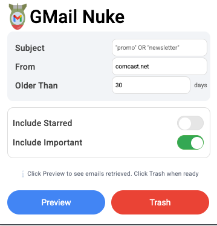
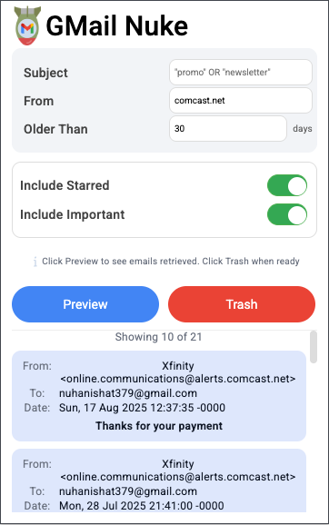
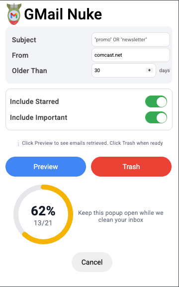
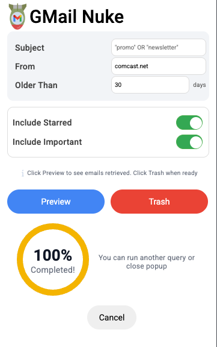

# Gmail Nuke 🚀  

  
  
  

Bulk-manage your Gmail inbox with a Chrome Extension.  
Preview matching emails, then move them to Trash in one click — powered by Gmail API + React.

---

## Features
- Build Gmail search queries (Subject, From, Date, etc.)
- Defaults to pulling all emails **older than 30 days** if no query is entered
- Preview results with infinite scroll
- Bulk trash with a progress bar (with cancel)
- Works with Gmail API OAuth (test users or your own client)

---

## Getting Started

You have two ways to run the extension:

### Option 1 — Be added as a test user (recommended)
The simplest way to try it.  
**Action:** Open an issue with your Google account email and I’ll add you as a **Test User** on the OAuth consent screen. Then:

1. `npm install`
2. `npm run build`
3. Go to `chrome://extensions` → enable **Developer mode** → **Load unpacked** → select the `dist/` (or `build/`) folder.
4. Click the extension icon to open the popup and sign in.

---

### Option 2 — Use your own Google OAuth client
If you prefer to self-host OAuth:

1. Go to **Google Cloud Console** → create a project and **enable Gmail API**.
2. Configure an **OAuth 2.0 Client ID** (**Application type:** *Chrome Extension*).  
   - Add an authorized redirect URI in the form:  
     `https://<YOUR_EXTENSION_ID>.chromiumapp.org/`  
     (You’ll see your extension ID in `chrome://extensions` after loading it.)
3. Put your Client ID in a `.env` at the project root:
      `VITE_GMAIL_CLIENT_ID=<your client id>`
4. 4. `npm install` → `npm run build` → load the built extension via `chrome://extensions`.

> Note: The app uses Gmail scopes for preview and trash. In **Testing** mode, you must add your Google account under **OAuth consent screen → Test users**.

---

## How It Works (Quick Walkthrough)

1. **Enter query**  
If you leave it blank, the extension pulls **all emails older than 30 days** by default.  

2. **Click Preview**  
Fetch a preview of matching emails with subjects/senders and infinite scroll.  

3. **Click Trash**  
Move the previewed set to **Trash**.  
*Note: Messages are recoverable in Trash for ~30 days per Gmail policy.*  

4. **All done 🎉**  
The progress bar completes at 100%. You can verify by checking your inbox count.  

---

## Disclaimer
This is an experimental side project. Use at your own risk — messages moved to Trash follow Gmail’s standard deletion window.

---

## Contributing
Issues and PRs are welcome. Ideas for improvements (labels, presets, analytics, etc.) are especially appreciated.